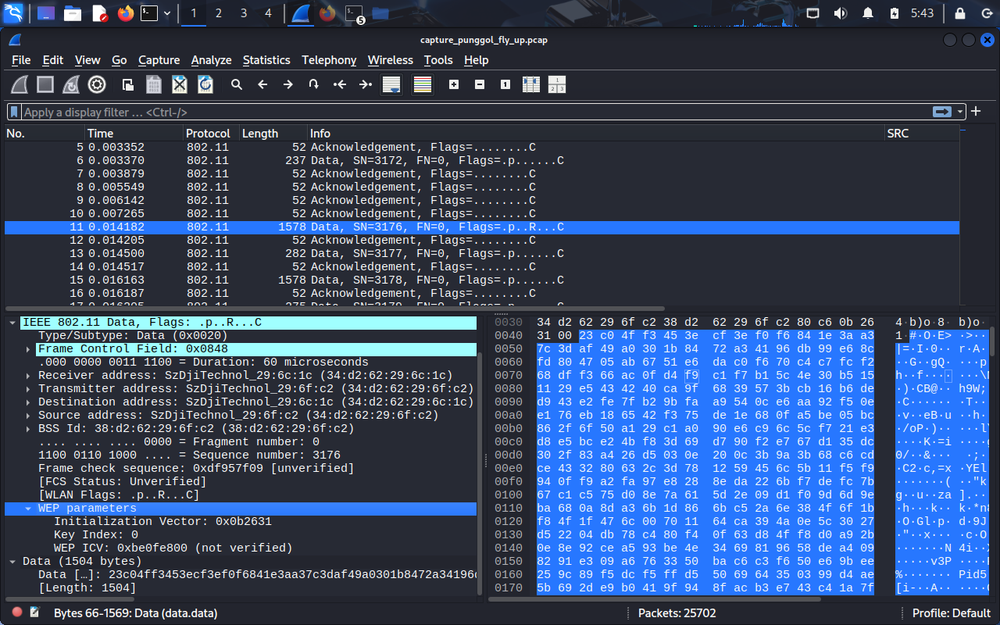
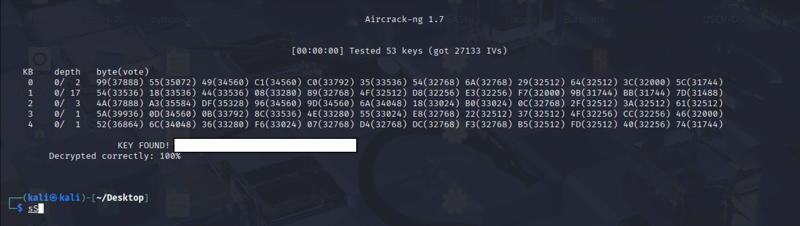
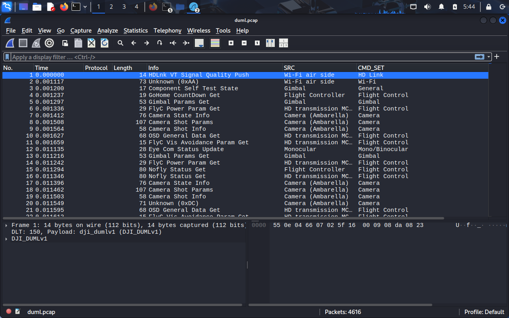

# DJI Enhanced WiFi Weak Cryptography (CVE-2025-10250)
DJI drones rely on two main communication protocols: **OcuSync**, used in larger drones, and **Enhanced Wi-Fi**, used in smaller models such as the DJI Spark, Mavic Air, and DJI Mini. Enhanced Wi-Fi leverages off-the-shelf Qualcomm wireless chipsets and standard 802.11 headers for communication.

## Capturing
Enhanced Wi-Fi operates with a **5 MHz channel width**, which is unusual and unsupported by most consumer Wi-Fi adapters like the TP-Link TL-WN722N. To capture traffic, we used a TP-Link router with an older Atheros chipset. Running OpenWRT on the router allowed us to use tcpdump for raw packet capture.

## WEP Encryption
Enhanced Wi-Fi follows standard 802.11 behaviour, including beacon frames and appropriate wireless headers. For control and telemetry, communication occurs over **UDP payloads**, with the receiver acknowledging packets via UDP datagrams.

These UDP payloads are encrypted using **Wired Equivalent Privacy (WEP)**, with the **Initialization Vector (IV)** transmitted within each 802.11 data frame. WEP is a legacy encryption standard that is widely regarded as insecure and is susceptible to modern cracking techniques.

By applying **Aircrack-ng** with a PTW attack, we successfully recovered the encryption key from only a 20-second capture. Notably, the recovered key remained static across multiple flights and reconnections, indicating key reuse and poor cryptographic hygiene.

## Further Analysis
Once decrypted, the payload becomes accessible. Using a [parsing tool](https://github.com/o-gs/dji-firmware-tools/blob/master/comm_dat2pcap.py) provided by the o-gs project, the traffic can be converted into a DUML pcap file to view the various communication types, including flight control commands exchanged between the RC and the drone.

## Implications
The reliance on WEP for critical control and telemetry is a serious vulnerability:

* **No replay protection**: WEP cannot defend against replayed packets.
* **Rapid key recovery**: Keys can be cracked within seconds using common tools.
* **Key reuse**: Static keys enable persistent compromise once recovered.

Together, these weaknesses make complete hijacking of the drone feasible, provided the command protocol is fully reconstructed.
